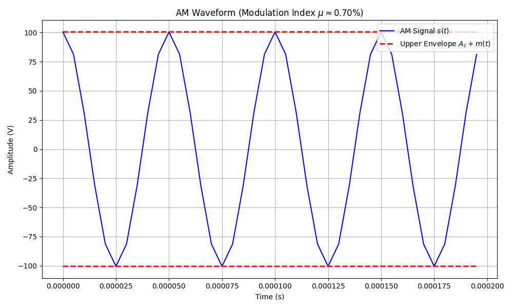
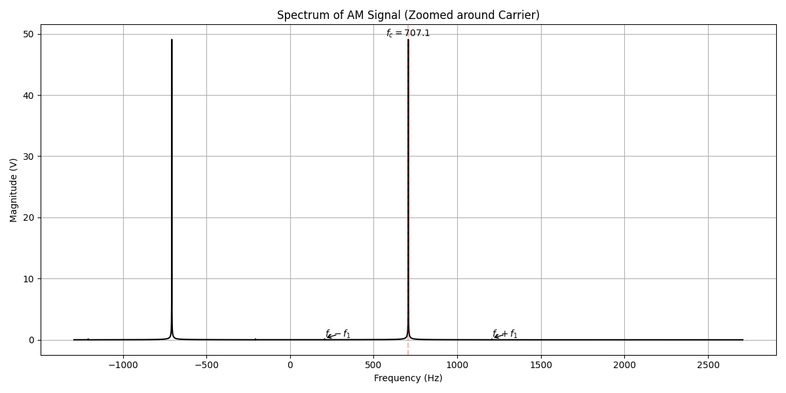

# AM Transmitter Problem Report

## Problem Statement
An AM transmitter is modulated with an audio testing signal given by:
$$ m(t) = 0.2\sin(\omega_1 t) + 0.5\cos(\omega_2 t) $$
where $f_1 = 500$ Hz, $f_2 = 500\sqrt{2}$ Hz, and $A_c = 100$. The AM signal is fed into a $50\, \Omega$ load.

**Assumption**: The original problem statement had "$\cos(\omega_1 t)$" for the second term but provided $f_2$. We assume the second term is meant to be at $f_2$, i.e., $m(t) = 0.2\sin(2\pi f_1 t) + 0.5\cos(2\pi f_2 t)$.

## Part (a): Sketch the AM Waveform

The AM signal equation is:
$$ s(t) = [A_c + m(t)] \cos(2\pi f_c t) $$
$$ s(t) = [100 + 0.2\sin(2\pi f_1 t) + 0.5\cos(2\pi f_2 t)] \cos(2\pi f_c t) $$

Since the modulation amplitude ($0.7$V max) is very small compared to the carrier amplitude ($100$V), the envelope variations are minute.

*Figure 1: AM Waveform showing the carrier and the envelope (red dashed line).*

## Part (b): Modulation Percentage

The modulation index $\mu$ is defined as the ratio of the peak message amplitude to the carrier amplitude.

$$ \mu = \frac{\max|m(t)|}{A_c} $$

The maximum value of $m(t) = 0.2\sin(\omega_1 t) + 0.5\cos(\omega_2 t)$ occurs when the peaks of the two sinusoids align. Since $f_1$ and $f_2$ are irrational with respect to each other ($f_2 = f_1\sqrt{2}$), they will eventually align constructively.
$$ \max|m(t)| = 0.2 + 0.5 = 0.7 $$

$$ \mu = \frac{0.7}{100} = 0.007 $$

**Modulation Percentage**:
$$ \% \text{ Modulation} = \mu \times 100\% = 0.7\% $$

## Part (c): Evaluate and Sketch the Spectrum

The AM signal can be expanded as:
$$ s(t) = A_c \cos(\omega_c t) + m(t) \cos(\omega_c t) $$
$$ s(t) = 100 \cos(\omega_c t) + [0.2\sin(\omega_1 t) + 0.5\cos(\omega_2 t)] \cos(\omega_c t) $$

Using trigonometric identities:
1. $0.2\sin(\omega_1 t)\cos(\omega_c t) = 0.1[\sin((\omega_c+\omega_1)t) - \sin((\omega_c-\omega_1)t)]$
2. $0.5\cos(\omega_2 t)\cos(\omega_c t) = 0.25[\cos((\omega_c+\omega_2)t) + \cos((\omega_c-\omega_2)t)]$

The spectrum consists of:
*   **Carrier**: component at $f_c$ with amplitude $100$.
*   **Sidebands**:
    *    at $f_c \pm f_1$ with amplitude $0.1$.
    *    at $f_c \pm f_2$ with amplitude $0.25$.

*Figure 2: Spectrum of the AM signal showing the carrier and sidebands.*
