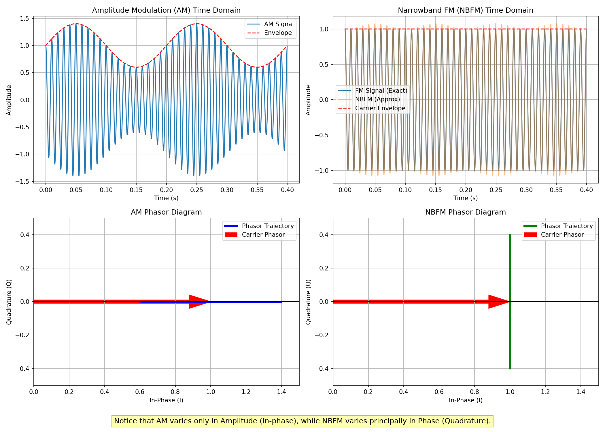
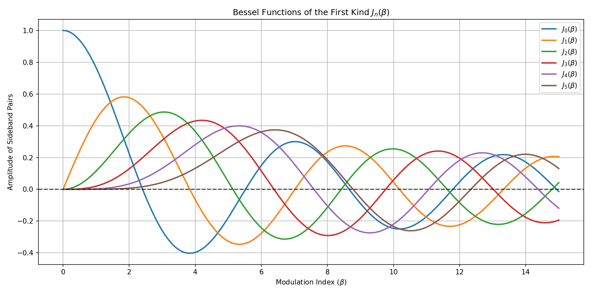
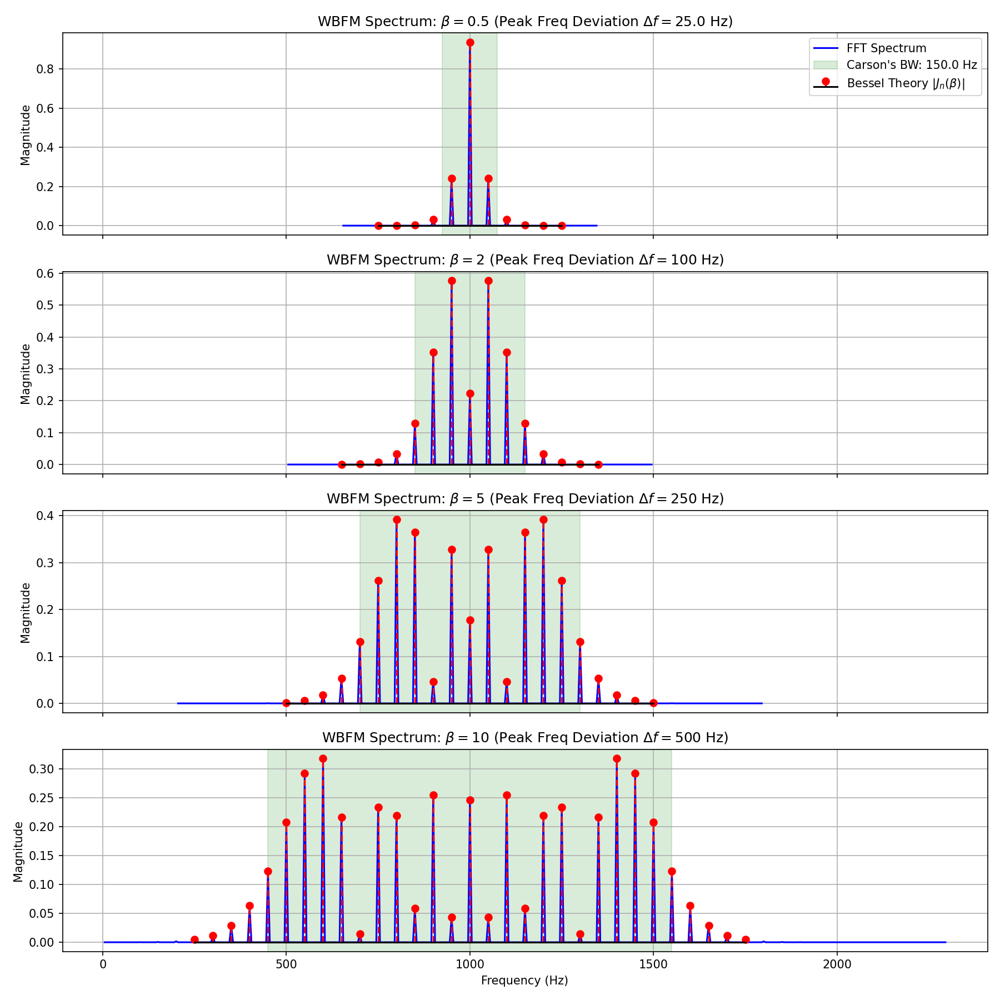
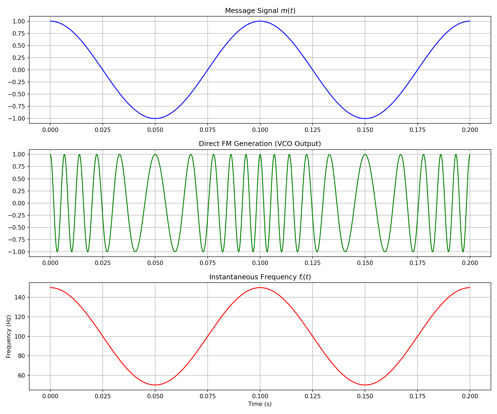
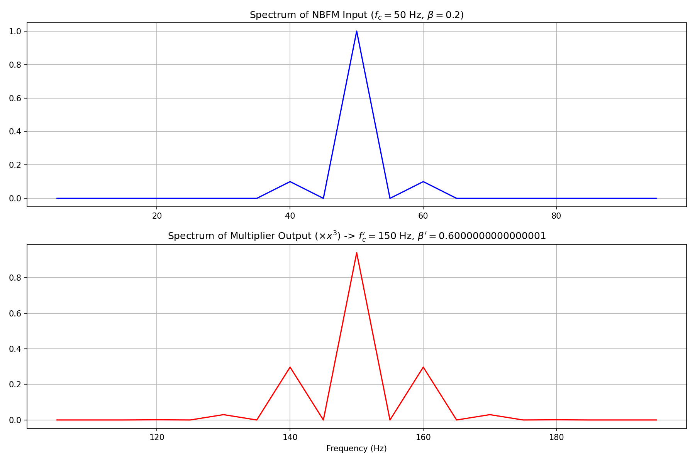

# Frequency Modulation (FM) Concepts and Simulations

Based on the theoretical FM concepts, this folder contains Python simulations that visually demonstrate the behavior of Narrowband FM, Wideband FM, and FM generation techniques.

## 1. Narrowband FM (NBFM) vs AM
The difference between Amplitude Modulation (AM) and Narrowband FM (NBFM) is subtly illustrated by comparing their mathematical representations for a single tone.

Recall:
*   AM: $s_{AM}(t) \approx A_c \cos(\omega_c t) + \frac{A_c \mu}{2}[\cos((\omega_c+\omega_m)t) + \cos((\omega_c-\omega_m)t)]$
*   NBFM: $s_{NBFM}(t) \approx A_c \cos(\omega_c t) + \frac{A_c \beta}{2}[\cos((\omega_c+\omega_m)t) - \cos((\omega_c-\omega_m)t)]$

The **lower sideband in NBFM is phase-reversed**. 
- In a **phasor diagram**, the sideband resultant for AM is collinear (in-phase) with the carrier phasor, causing the amplitude to fluctuate.
- For NBFM, the reversed lower sideband causes the resultant sideband phasor to be perpendicular (quadrature) to the carrier. This swings the phase while leaving the amplitude largely constant.

*(You can run `python 1_NBFM_vs_AM.py` to regenerate these plots)*

---

## 2. Wideband FM (WBFM) Spectrum
For Wideband FM ($\beta > 1$), the signal expands into an infinite series of sidebands spaced by $f_m$. The amplitude of each sideband at $f_c \pm n f_m$ is determined by the **Bessel function of the first kind**, $J_n(\beta)$.

### Bessel Functions $J_n(\beta)$
As $\beta$ grows, power shifts from the carrier ($J_0$) into higher-order sidebands ($J_1, J_2, \dots$). At certain values of $\beta$, the carrier completely vanishes ($J_0(\beta) = 0$).

### Spectrum & Carson's Rule
The true bandwidth of an FM signal is theoretically infinite. However, the effective transmission bandwidth is approximated by **Carson's Rule**:
$$ B \approx 2(\Delta f + f_m) = 2 f_m (\beta + 1) $$
The simulation below plots the Fast Fourier Transform (FFT) of the WBFM signal, verifies the peak amplitudes against theoretical Bessel values, and highlights Carson's bandwidth boundary.

*(You can run `python 2_WBFM_Spectrum.py` to regenerate these plots)*

---

## 3. Generation of FM Signals

FM is generally preferred over AM in high-frequency applications (e.g., microwave links) because its constant amplitude avoids non-linear distortion, easing requirements on power amplifiers.

### Direct Generation (VCO)
A Voltage Controlled Oscillator (VCO) directly translates the message amplitude into instantaneous frequency changes. 
$$ f_i(t) = f_c + k_f m(t) $$
While conceptually simple, free-running VCOs suffer from frequency drift.

### Indirect Generation (Armstrong Method)
To solve the stability issues of Direct FM, the Indirect method starts with a highly stable but low-deviation (NBFM) oscillator. 
To gain the required wideband characteristics (higher $\beta$ and $\Delta f$), the NBFM signal is passed through a **frequency multiplier** (a non-linear device). 

If a multiplier increases the base center frequency by a factor of $n$ (so $f_c^\prime = n f_c$), it simultaneously multiplies the frequency deviation ($n \Delta f$), expanding the bandwidth appropriately without altering the modulating message frequency $f_m$.

The simulation demonstrates creating an NBFM signal and sending it through a polynomial nonlinearity ($\approx x^3$), achieving a factor $n=3$ multiplication of the spectrum.

*(You can run `python 3_FM_Generation.py` to regenerate these plots)*
